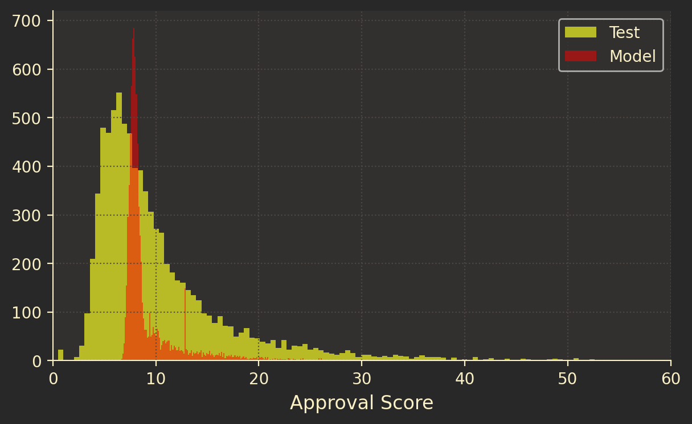
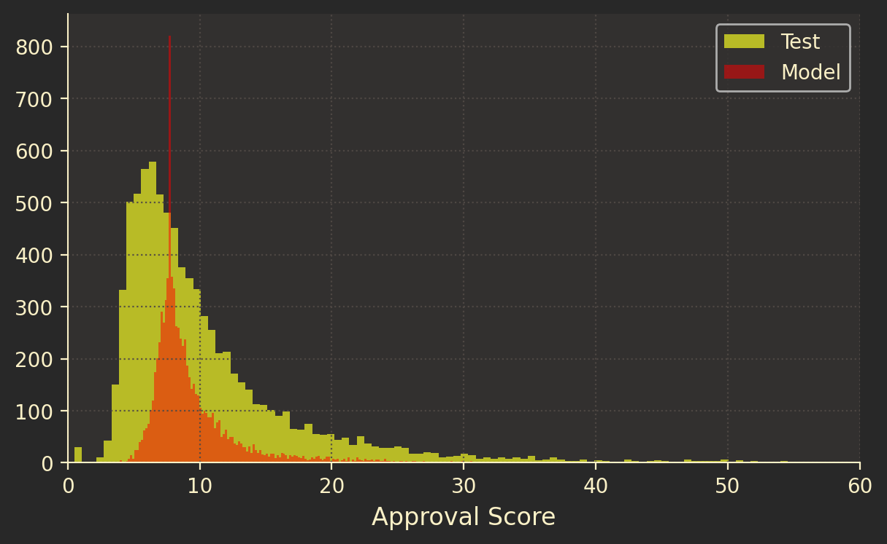
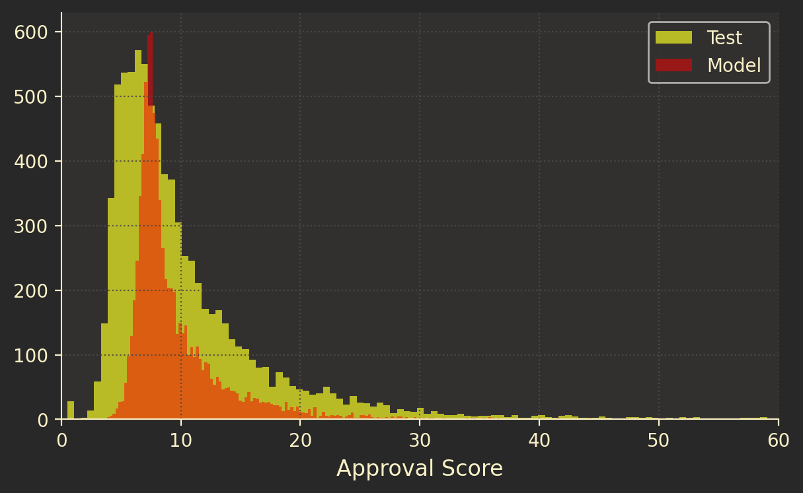
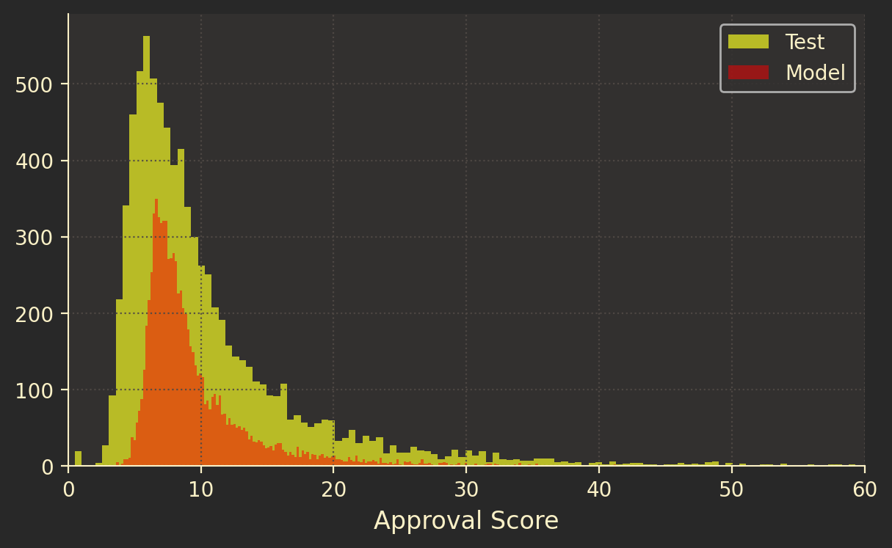
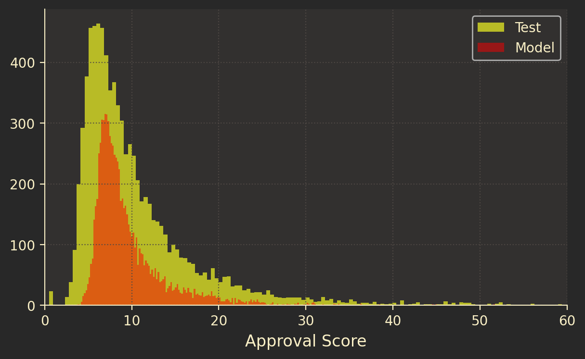
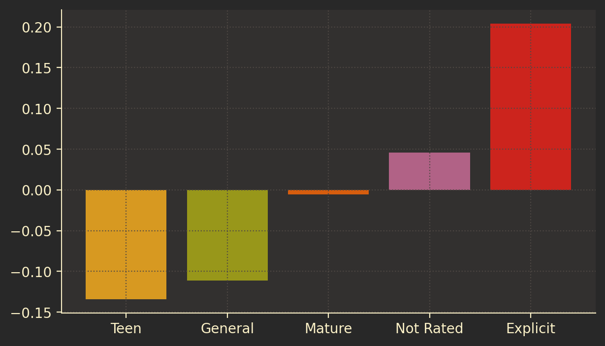
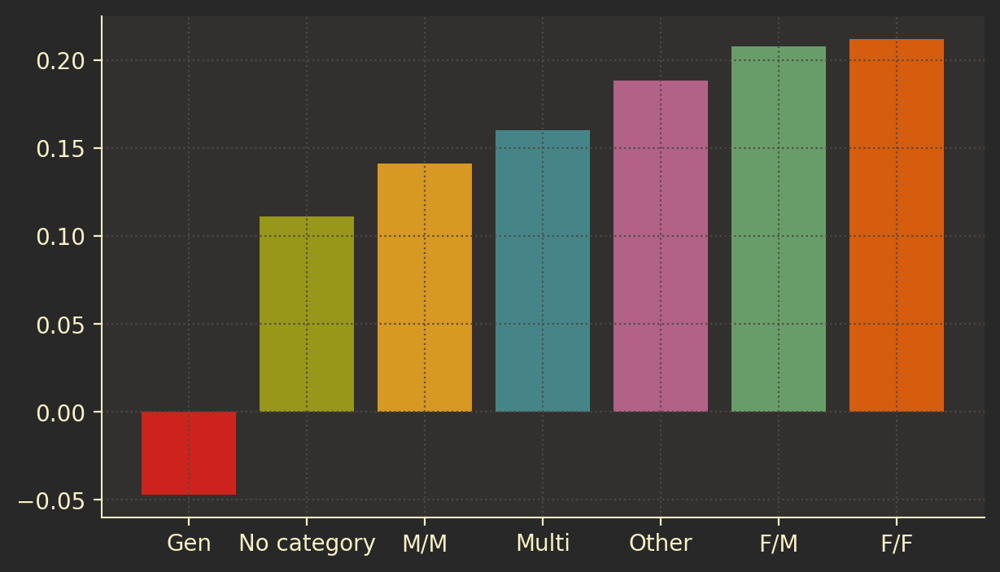
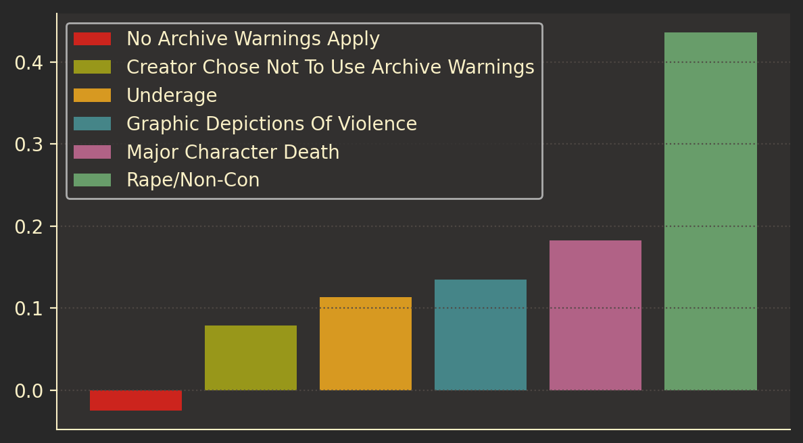

Fanfiction is an odd beast. It's a uniquely id-based form of art-- more than any other medium, the entire point of fanfiction is, to some degree, wish fulfillment. What are those wishes? As a child of Web 2.0 fandom, I have some intuitions, but I'm just one person, and in many ways I'm not really your typical fan (more on that later). 

## The Basics

The purpose of this project is, more or less, to attempt to characterize the things people like (and don't) in fanfiction. In order to do that, we needed a data source. Luckily, the fandom world boasts a well-maintained and fairly central fanfiction repository: the Archive of Our Own. Not so luckily, they're none too keen on data scraping (worried about people training machine learning models on fanfiction, I think). I won't bore you with the technical details, but I adapted an existing library to get the metadata for all fics in any given fandom and save it locally. 

At this point, we ran into the first real decision of the project: which fandom do we start with? Basically on a whim, I picked *Our Flag Means Death*, the 2022 TV show starring Taika Waititi and Rhys Darby. I'd seen a lot of excitement about it in my own little corner of the Web (though it didn't seem like something I would enjoy), and it had about 25,000 works on the Archive (hereafter referred to, as is customary, as AO3): big enough to hopefully be representative of broader fandom trends, but not so big that modelling would take too terribly long. 

Once our script was up and running, we could inspect the following properties of any given piece of fanfiction:

- Word count
- Date published
- Date updated
- Number of chapters
- Number of expected chapters: when publishing a multi-chapter work, AO3 lets you set the number of chapters you expect the work to contain once it's finished. This is a handy way to find incomplete fics: select all where number of chapters < number of expected chapters.
- Author: AO3 has a user system, so you can see all works by a given author (though works can also be published anonymously, or "orphaned" after their publication).
- Series: Works can have multiple chapters, but they can also be chained together. Typically, each work in a series is self-contained, but they all fit together in some fashion, like episodes of a TV show.
- Characters: Any characters featured in the fanfiction. AO3 has people working behind the scenes to keep these consistent, so that e.g. "Ben Solo" and "Kylo Ren" aren't separate character labels when they in fact reference the same character. Note that this is not a required field.
- Rating: This is a required field. There are four ratings a fanfiction can have:
	- General: G/PG. Nothing objectionable here.
	- Teen: PG-13. Violence, language, some sexuality, but nothing explicit.
	- Mature: R. More intense violence, and possibly a sex scene or two, though typically described in relatively euphemistic terms. Most romance novels would fall into this category.
	- Explicit: NC-17. This is almost exclusively used for written pornography.
	Authors can also choose not to rate their fanfiction. This is a required field: you have to either choose one of the four ratings detailed above, or explicitly say you're choosing not to rate it.
- Relationships: Any relationships present in the fanfiction. This isn't a required field (not all fanfiction is about characters getting together, though the lion's share certainly is). Something to note is that "relationships" don't have to be romantic: the convention is to denote platonic pairings with an ampersand and romantic pairings with a slash, so e.g. a fanfiction about Buffy and Giles' father-daughter relationship would be labeled "Buffy Summers & Rupert Giles", and a fanfiction about Buffy and Giles having sex would be labeled "Buffy Summers/Rupert Giles". Ampersand tags and slash tags are conceptually distinct, so a search for one won't include works tagged with the other unless a work happens to be tagged with both a slash tag and an ampersand tag (perhaps if the work involves a relationship developing from a friendship into a romance).
- Warnings: These are mandatory, and AO3 is pretty strict about enforcing them. There are four warnings and six warning-related categories. A fanfic must fall into at least one category, and can have any number of warnings, which are:
	- Graphic Depictions of Violence: What it says on the tin.
	- Rape/Non-con: Non-con stands for "non-consensual." This is generally only used if rape happens on-screen, as it were, though people will sometimes err on the side of caution and use this warning for mentions of sexual assault as well as the actual act.
	- Major Character Death: Also what it says on the tin. Interestingly, this also includes fanfiction about canon events that involve a death, so that e.g. a fanfiction about Buffy's death in the fifth season of *Buffy the Vampire Slayer* would have this warning even though the author isn't making the decision to kill Buffy off themselves.
	- Underage: Characters under the age of consent in explicitly or implicitly sexual situations. This is the most controversial one, and probably the most variable. There are, of course, legal concerns about child pornography, which are different depending on the country. AO3 is registered as an NGO in the United States, where the law around child sexual assault material (CSAM) is relatively permissive, given speech protections. It's important to note, though, that this tag is highly technical. Fanfiction about, for example, Faith and Xander having sex would have this warning, since at least one participant is under the age of consent-- despite the fact that 1) that's a canonical event and 2) we typically don't think about high school seniors having consensual sex with each other as even in the same ballpark as CSAM. 
	If a fanfiction contains none of the subject matter covered by the warnings, it gets the warning category "No Archive Warnings Apply". If an author doesn't want to explicitly warn readers about the subject matter, it gets the warning category "Creator Chose Not To Use Archive Warnings": essentially, "this work may or may not contain any and all of the content covered by the warnings, so tread with caution".
- Tags: Not mandatory. These are labels that cover any other aspects of the fanfiction the author wants to advertise. Common examples includes:
	- "Angst": Bad things happening to characters.
	- "Fluff": Good things happening to characters.
	- "Hurt/Comfort": Angst, then fluff, in that order.
	- "{something} AU": AU stands for Alternate Universe; works with this tag imagine different settings, and sometimes entirely different storylines, for the characters.
- Kudos: AO3's version of likes. You can only leave kudos once per work, regardless of how many chapters the work has. 
- Hits
- Number of comments
- Number of bookmarks: AO3 allows registered users to save works they particularly enjoyed, and make them public on their profile if they so choose.

Now we could begin to build our model!
## The Model

The first modelling decision we had to make was what exactly we wanted our model to predict. Essentially what we were after was some way to measure not just the raw popularity of a fanfic-- that would be subject to all kinds of noise we were keen to avoid[^1] -- but rather its popularity adjusted for its exposure. Of the people who came across this fanfic, what proportion of people enjoyed it? AO3 records hits, but not necessarily views, since the inferface for discovering fanfics displays summaries, tags, ratings, and previews several to a page, and hits reference individual work pages rather than discovery/search result pages. With that in mind, we were limited to measuring hits against kudos: of everyone who clicked through to this fanfic (and presumably at least started reading it), what proportion liked it enough to hit the "kudos" button?  We decided to capture this figure, which from here on out I'll refer to as "approval", as `log(hits)/log(kudos)`. Nadav helpfully described approval as the number of people who have to visit a fanfic before it gets its *n*th kudo.

Once we had an idea for how we could benchmark popularity, we moved on to feature engineering. The simplest features to encode were also (at least to me) the least interesting, especially given that several of them were already off limits on account of their relationship with hits and kudos (and therefore approval). We didn't want to "cheat" by telling the model about the number of bookmarks and comments a fanfic had, since those have an obvious relationship with the number of hits (necessarily strictly greater than, actually-- you can't comment on or bookmark a fanfic without first navigating to its page at least once) and the number of kudos. 

Still, we had to start somewhere. Our first model (after several rounds of troubleshooting and data cleaning) had as its features number of chapters and word count, and it looked like this:

Yikes. We're in the correct ballpark in terms of magnitude, but since we're interested in examining the model's coefficients (the relative weights of each feature), really what we're after is a distribution, of whatever magnitude, that matches the shape of the test data-- which this model most certainly does not. It looks like we might need to add a few more features, which meant figuring out how to encode non-numeric properties of our dataset (which we'd need to do at some point anyway-- most of the interesting stuff is bound up in there). The top of my feature wishlist was tags. AO3 authors use them extensively, and they're an excellent proxy for content, tone, and mood of a fanfic-- in other words, exactly the qualities we were hoping to characterize.

Here's the thing: there are a *lot* of tags. Creating a tag is as simple as adding it to the "tags" field on your fic, so while AO3's volunteer "tag wranglers" do their best to keep the system coherent, there's a limit to what they can accomplish. In addition, since each fanfic can have as many tags as its author desires, any encoding scheme would have to be a matrix of the form `len(samples) * len(unique(samples.tags))`. Yuck.

Given those constraints, we decided to only include the tags in our dataset that were in the 99th percentile of usage. After all, we were interested in the effect that tags had on reader response: we could probably afford to ignore tags that didn't get a lot of use, since those likely didn't signal much of anything to the reader. When we applied our filtering algorithm to the Our Flag Means Death corpus, we were left with about six hundred unique tags. From there, we could implement a multi-hot encoder that flagged each fanfic in our sample set with a 1 if it had the tag and a 0 if it didn't. Here's our model's attempt to predict approval rating based on tags:

And based on tags plus the numeric features from the first run:

Getting there! Let's see what happens when we add in categories, ratings, and warnings: 

As we've added features, our model's distribution has gotten closer in shape to the distribution of the test data, which is what we hoped would happen. Nadav suggested ridge regression in order to regularize our predictions further, given that many of our features are likely correlated with one another (e.g. pretty much only fanfics labeled "Explicit" will contain the "BDSM" tag). This helped, though not as much as we'd hoped. Here's our ridge regression, with an alpha of 0.5:

## So What?
Once we had the final (for now) version of the model up and running, we were able to get a sense for the relative impacts of our features: given everything else about a fanfic, how much does the presence of each individual feature affect its approval score? We can evaluate this based on our model's coefficients, which you can think of as the weights applied to each feature. A negative weight indicates that fanfics with this feature tend to receive lower approval ratings than those without; a positive one indicates the inverse.

One important thing to remember as we're interpreting these numbers is that what we're measuring isn't actually popularity, but rather approval. If fanfics rated Explicit have a high approval coefficient, that doesn't necessarily mean that those works get more eyeballs on them than works rated Gen, Teen, or Mature,  but rather that of the people who read fanfics rated Explicit, a higher percentage of them leave kudos than the percentage who leave kudos on fics with other ratings. You can think of approval as something like an enthusiasm barometer: how excited, in general, are people about fanfics with this tag?

### Ratings

Right away we're seeing some interesting stuff with ratings. The more explicit a fanfic's rating, the higher its approval score is likely to be: in other words, people are the most excited about porn and porn-adjacent topics. The "Teen" and "General" categories are significantly less likely to garner approval, and "Mature" is somewhere in the middle. For reference, here's the frequency of "Explicit" ratings:

|    | Rating                |   Count |   % of Total |
|---:|:----------------------|--------:|-------------:|
|  0 | Not Rated             |    1291 |      4.66891 |
|  1 | General Audiences     |    4351 |     15.7354  |
|  2 | Teen And Up Audiences |    7640 |     27.6301  |
|  3 | Explicit              |    9790 |     35.4056  |
|  4 | Mature                |    4579 |     16.56    |

### Categories

Unsurprisingly, people really love shipping. More surprisingly, male/male (coloquially referred to in fandom as "slash") is the *least* well-liked flavor of shipping, at least in this particular fandom. Here's where we might be seeing the effects of our approval score being insensitive to popularity: while people tend to approve more of heterosexual and female/female (fandom-ese: "femslash") pairings, that doesn't necessarily mean that heterosexual and femslash pairings dominate the shipping tastes of the fandom as a whole. And indeed, if we look at the raw data, we find...

| Category | Count | % of Total |
| :--- | ---: | ---: |
| F/M | 759 | 2.74493 |
| M/M | 23124 | 83.6281 |
| Other | 1696 | 6.13359 |
| Multi | 2387 | 8.6326 |
| Gen | 2872 | 10.3866 |
| No category | 922 | 3.33442 |
| F/F | 673 | 2.43391 |

Slash pairings make up a whopping *84%* of the total number of works in the fandom. Clearly, there are rewards for writing for a niche audience.

### Warnings

Huh. This isn't what I expected to see, I'll say that much. Here's another frequency table, for reference: 
| Warning | Count | % of Total |
| :--- | ---: | ---: |
| Graphic Depictions Of Violence | 1703 | 6.15891 |
| Underage | 71 | 0.256772 |
| Creator Chose Not To Use Archive Warnings | 6409 | 23.1782 |
| No Archive Warnings Apply | 19380 | 70.0879 |
| Major Character Death | 568 | 2.05418 |
| Rape/Non-Con | 451 | 1.63104 |

As you can see, all the named warnings put together only make up about eight percent of the total corpus, so we have another case where we should note that we're measuing *approval* among readers, not *popularity* among the general population. An analagous situation might be an exit poll of people who voted for Bernie Sanders in the Democratic primary of 2020 measuring enthusiasm for the candidate, compared with an exit poll of everyone who voted in that primary. Just because Sanders' voters were fired up to cast their ballot for him and thought he'd be a fantastic president does not mean that their opinions were shared by the majority of rank and file members of the Democratic Party. 

So a relatively small proportion of the fanfiction community (at least, this fanfiction community) is very enthusiastic about writing and consuming what one might euphemistically call controversial material: writing that transgresses, in one form or another, the agreed-upon moral norms of most of the modern world. Why might that be? One feature of the graph above that immediately jumps out to me is just how enthusiastic people are about fanfiction that involves sexual assault, typically sexual assault in explicit detail. Internet fandom is mostly made up of women, and it has a strong left-wing bent. It's not the type of place you'd expect to find people fetishizing violence against women-- or so you would think, if not for the inconvenient truth that women themselves are doing the majority of the fetishizing. The broader question of why this happens at all is far beyond the scope of this post, but suffice it to say that what we're seeing here isn't exactly an epidemic of male writers titillated by graphic descriptions of rape. 

## Conclusions (For Now)
Keen-eyed readers will notice that I did not include in the analysis above any information about the tag distribution I was so excited to examine. As it turns out, I was excited for a good reason: there are a number of fascinating trends in the tags, and as this post is already almost 3,000 words long I'd like to devote more space than I have here to diving into them. Additionally, I have some intuitions about the tags from just glancing at the coefficients, but I'd like to see if those bear out mathematically, which will require yet more feature engineering.

Still, even *sans* tags, there are a number of interesting interpretations that present themselves. There seems to be a definite positive correlation between marker frequency and approval rating: e.g. things that are less popular in absolute terms tend to generate more enthusiastic responses. The big exception to this is explicitness: pornography is both very common (the most common, in fact, of the five possible categories) and very high approval. People are *really* excited about erotica.

Of course, this is just one fandom: obviously all of this could be peculiar to the *Our Flag Means Death* folks. Before any of this can be generalized, we need to see which trends bear out in a diverse sampling of fandoms, and which trends seem to be peculiar to fandoms with certain qualities. This meta-level analysis-- what qualities make a piece of media more or less likely to generate fanfiction?-- was originally the goal of this project, and though it's now thoroughly bifurcated, I do hope at some point to bring both halves back together into a coherent theory of the fanfiction ecosystem.

